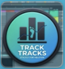

# TrackTracks — Per-Track CPU Monitor for Ableton Live (ALL VERSIONS!)

> **Finally know which track is killing your session.**



Real-time per-track and per-device CPU monitoring for Ableton Live 12 on macOS. When your session is spiking and Ableton's single CPU meter tells you nothing, TrackTracks tells you exactly which track and which plugin is the culprit.

> **CPU impact: ~0.3% on a completely separate process. Zero effect on your audio engine.**
> The remote script reads values Ableton already calculates internally — it adds no new computation to your session. The viewer runs entirely outside Ableton. Your buffer, your latency, and your CPU headroom are untouched.

---

## The Problem

Ableton's built-in CPU meter shows total load — but when 15 tracks are running and your session is grinding, which one is the culprit? You freeze tracks at random, bounce things down, and still can't find the spike.

TrackTracks tells you exactly which track and which plugin is killing your CPU, in real time.

---

### Why Not Just Use Ableton's CPU Meter?
_
Ableton's meter shows one number: total load. It tells you the house is on fire. It doesn't tell you which room.

| | Ableton CPU Meter | TrackTracks |
|---|---|---|
| Total session load | ✅ | ✅ |
| Per-track breakdown | ❌ | ✅ |
| Per-plugin breakdown | ❌ | ✅ |
| 18-second history | ❌ | ✅ |
| Peak hold marker | ❌ | ✅ |
| Alert when threshold hit | ❌ | ✅ |
| Runs outside Ableton | — | ✅ |

---

## How It Works

```
Ableton Live 12
  └── Python Remote Script (runs inside Ableton)
        reads device.cpu_load for every plugin on every track
        streams JSON over UDP → localhost:7400
              ↓
TrackTracks Viewer (PyQt6 desktop app)
  live sparkline bars, peak hold, per-device drill-down
```

---

## Features

- **Sparkline history bars** — 18-second rolling CPU history per track
- **Smooth 60fps animation** with peak-hold tick marker (5-second window)
- **Per-device breakdown** — click ▶ to expand and see every plugin's CPU
- **Ableton track colour** indicator and track-type badge (Audio / MIDI / Group / Return)
- **Session maximum** tracking per track since app launch
- **Live header** — BPM, play state, time signature, total CPU bar, Ableton process CPU
- **Sort** by CPU↓ CPU↑ Name or Ableton track order
- **Filter** — All / Active only / High CPU only
- **Alert threshold** — macOS notifications when a track exceeds X% for 2+ seconds
- **Freeze** — pause the display without stopping monitoring
- **Always-on-top** toggle
- **CSV export** to Desktop
- **Return tracks** section
- Keyboard shortcuts: `Space` freeze · `T` pin · `E` export · `Esc` clear alerts

---

## Requirements

- macOS (Apple Silicon)
- Ableton Live 12 Suite (or any edition)
- Python 3.9+
- PyQt6, psutil

---

## Installation

### 1 — Install the Ableton Remote Script

Copy the script into Ableton's MIDI Remote Scripts folder:

```bash
cp -r remote_script/TrackCpuMonitor \
    "/Applications/Ableton Live 12 Suite.app/Contents/App-Resources/MIDI Remote Scripts/"
```

Restart Ableton, then go to **Preferences → Link/Tempo/MIDI → Control Surfaces** and select **TrackCpuMonitor** in an empty slot.

### 2 — Install Python dependencies

```bash
cd viewer
pip3 install -r requirements.txt
```

### 3 — Run the viewer

```bash
arch -arm64 python3 viewer/main.py
```

Or double-click **TrackTracks.app** (build it once with the instructions below).

### 4 — Build the .app launcher (optional)

```bash
# Convert logo to .icns
mkdir -p /tmp/tt.iconset
for size in 16 32 64 128 256 512 1024; do
  sips -z $size $size assets/tracktracks_logo.png --out /tmp/tt.iconset/icon_${size}x${size}.png
done
for size in 16 32 128 256 512; do
  cp /tmp/tt.iconset/icon_$((size*2))x$((size*2)).png /tmp/tt.iconset/icon_${size}x${size}@2x.png
done
iconutil -c icns /tmp/tt.iconset -o assets/tracktracks.icns

# Build .app
APP=~/Desktop/TrackTracks.app
mkdir -p "$APP/Contents/MacOS" "$APP/Contents/Resources"
cp assets/tracktracks.icns "$APP/Contents/Resources/"
cp build/Info.plist "$APP/Contents/"
cp build/launcher.sh "$APP/Contents/MacOS/TrackTracks"
chmod +x "$APP/Contents/MacOS/TrackTracks"
```

---

## Project Structure

```
track_cpu_monitor/
├── remote_script/
│   └── TrackCpuMonitor/
│       └── __init__.py        ← Ableton Python remote script
├── viewer/
│   ├── main.py                ← PyQt6 desktop viewer
│   └── requirements.txt
├── assets/
│   └── tracktracks_logo.png
└── build/
    ├── Info.plist
    └── launcher.sh
```

---

## Architecture Notes

Ableton Live exposes `device.cpu_load` (0.0–1.0) on every device object through its Python Remote Script API. The remote script reads this for all devices on all tracks every 200ms and streams a JSON payload over UDP to localhost. The viewer receives it, smoothly animates the bars at 60fps, and handles sorting, filtering, and alerts entirely in the display layer.

---

## License

MIT

---

*Built for producers who need to know, not guess.*


---

## Part of Creative Konsoles

Built by [Creative Konsoles](https://creativekonsoles.com) — tools built using thought.

**[creativekonsoles.com](https://creativekonsoles.com)** &nbsp;·&nbsp; support@creativekonsoles.com

<!-- repo maintenance: 2026-04-04 -->
